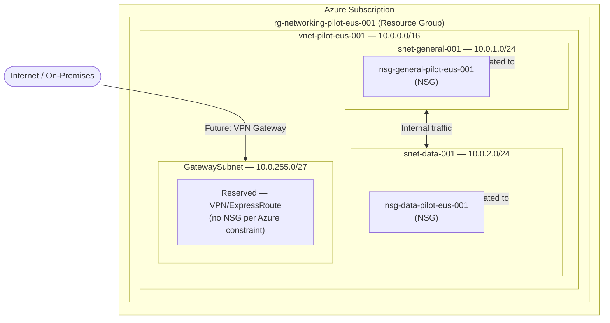

# Deployment Log: Standard Azure VNET — Pilot

---

## Executive Summary

**Date:** 2026-04-28
**Client ID:** TBD — Pilot Engagement (Subscription ID not yet provided)
**Environment:** Pilot (treated as DEV)
**Engagement Scope:** Initial VNET deployment for pilot network foundation
**Architectural Pattern:** Standard Hub-Ready VNET with NSG Subnet Segmentation
**Outcome:** `Simulation — Pending EXECUTION APPROVED`

> **HITL Status:** Plan presented. No resources have been deployed. Awaiting client `EXECUTION APPROVED` signal before proceeding.

---

## Execution Details

- **Identity Used:** TensorEdge-1 (TE-1) — AaaS Agent
- **Roles Activated:** N/A — simulation only; expected roles for execution: `Contributor` (Resource Group scope) or `Network Contributor` (VNET scope)
- **Deployment Tool:** Azure CLI (planned)
- **Naming Standard Applied:** Azure CAF default — client naming policy not yet confirmed

---

## Action Plan Snapshot

> [!NOTE]
> This section contains the specific plan logic presented to the Lead Architect. No approval has been received as of the journal date.

---

## --what-if Simulation Table

| Step | Resource Type | Name | Action | Config |
|---|---|---|---|---|
| 1 | Resource Group | `rg-networking-pilot-eus-001` | Create | Region: `eastus` |
| 2 | Virtual Network | `vnet-pilot-eus-001` | Create | Address space: `10.0.0.0/16`, DNS: Azure default |
| 3 | Subnet | `snet-general-001` | Create | CIDR: `10.0.1.0/24`, inside VNET |
| 4 | Subnet | `snet-data-001` | Create | CIDR: `10.0.2.0/24`, inside VNET |
| 5 | Subnet | `GatewaySubnet` | Create | CIDR: `10.0.255.0/27`, reserved for gateway use |
| 6 | NSG | `nsg-general-pilot-eus-001` | Create | Default deny-all inbound; allow VNet inbound |
| 7 | NSG | `nsg-data-pilot-eus-001` | Create | Default deny-all inbound; allow only `snet-general-001` source |
| 8 | NSG Association | — | Associate | `nsg-general-pilot-eus-001` → `snet-general-001` |
| 9 | NSG Association | — | Associate | `nsg-data-pilot-eus-001` → `snet-data-001` |

---

## Resources Deployed

> None — simulation only. The table above reflects planned resources pending approval.

---

## Role Assignments Applied

> None — no deployment has occurred.

---

## Open Items (Blocking Execution)

| # | Item | Status |
|---|---|---|
| 1 | Subscription ID | Not provided |
| 2 | Client Naming Convention Policy | Not confirmed — CAF defaults assumed |
| 3 | DNS configuration (Azure default vs. custom) | Not confirmed |
| 4 | Service Endpoints / Private Endpoints scope | Out of scope for this plan; to be confirmed |

---

## Supersession Flag

**Triggered:** No
**Reason:** This is a new log entry. No existing wiki entries were modified or superseded by this simulation.

---

## Notes

- `GatewaySubnet` carries no NSG by Azure platform constraint — attaching one breaks VPN/ExpressRoute gateway behaviour.
- Pilot environment will be used to validate naming conventions and NSG rule sets before any PROD promotion.
- This journal entry must be updated with actual resource names, outcomes, and role assignments once `EXECUTION APPROVED` is received and deployment is confirmed complete.
