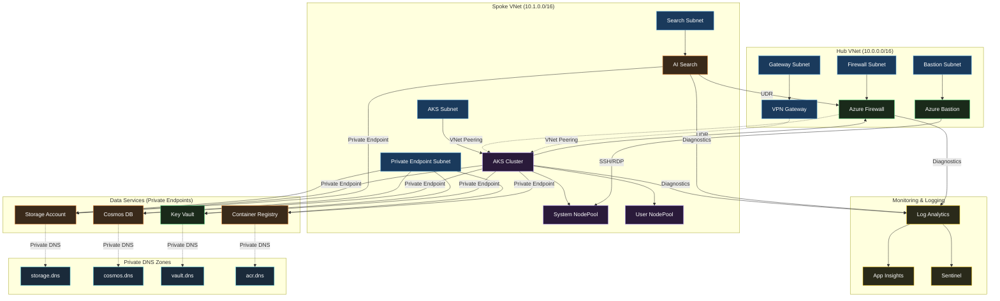

## Brief

Design a production-grade RAG (Retrieval-Augmented Generation) infrastructure in Qatar Central. Use a Hub-Spoke VNet topology. The Spoke should contain an AKS cluster for AI agents and an Azure AI Search instance. The Hub should have an Azure Firewall and a VPN Gateway. Ensure all backend data services use Private Endpoints.
Budget: Under $5k

## Architecture

# Azure RAG Infrastructure – Qatar Central

## Architecture Summary

### Component Overview
This production-grade RAG infrastructure implements a **Hub-Spoke VNet topology** in Qatar Central, optimised for AI agent workloads with strict cost and security controls. The architecture isolates AI compute and search services in a dedicated spoke while centralising network security and gateway functions in the hub.

**Hub VNet (10.0.0.0/16):**
- Azure Firewall (for egress filtering and inter-VNet routing)
- VPN Gateway (for hybrid connectivity)
- Gateway Subnet, Firewall Subnet, Bastion Subnet

**Spoke VNet (10.1.0.0/16):**
- AKS Cluster (system and user node pools)
- Azure AI Search instance
- Private Endpoints for all backend services
- Dedicated subnets for compute and data services

**Data Services (Private Endpoints only):**
- Azure Storage Account (for RAG document corpus)
- Azure Cosmos DB (for vector embeddings cache)
- Azure Key Vault (for credential management)
- Azure Container Registry (for AKS image pulls)

### Network Topology
- **VNet Peering:** Hub ↔ Spoke (bidirectional, transit enabled)
- **Routing:** All spoke egress routes through Hub Firewall via User Defined Routes (UDRs)
- **Private Endpoints:** All backend services consume via private DNS zones (no public IPs)
- **NSGs:** Granular rules per subnet (AKS ingress from Bastion, AI Search from AKS only)
- **DNS Resolution:** Private DNS zones linked to both Hub and Spoke VNets

### Security Best Practices
- **Network Segmentation:** Dedicated subnets for AKS system/user nodes, AI Search, private endpoints, and gateway functions
- **Zero Public IPs:** All resources (VMs, containers, services) communicate via private IPs; no public endpoints exposed
- **Azure Firewall:** Centralized egress filtering; deny-by-default outbound rules; allow only required destinations (Azure services, package registries)
- **Private Endpoints:** All data services (Storage, Cosmos DB, Key Vault, ACR) accessed exclusively via private endpoints in dedicated subnet
- **RBAC:** Managed identities for AKS pods; Key Vault access via Azure AD authentication
- **Azure Bastion:** Jumphost in Hub for secure RDP/SSH to AKS nodes (no public IPs on nodes)
- **NSG Rules:** Explicit allow rules; AKS ingress from Bastion only; AI Search ingress from AKS subnet only
- **Encryption in Transit:** TLS 1.2+ enforced on all private endpoints; VPN Gateway uses IPSec
- **Encryption at Rest:** Storage Account encryption (Microsoft-managed keys); Cosmos DB encryption enabled; Key Vault for secret rotation
- **Azure Defender for Cloud:** Enable for AKS, Storage, and Key Vault; continuous vulnerability scanning
- **Azure Sentinel:** Ingest NSG flow logs and Firewall logs for threat detection
- **Pod Security Policies:** Enforce in AKS (no privileged containers, read-only root filesystem)
- **Network Policies:** Calico CNI for AKS; restrict pod-to-pod traffic (AI agent pods → AI Search only)
- **Audit Logging:** Enable diagnostic settings on Firewall, VPN Gateway, NSGs, and Key Vault; ship to Log Analytics

### Compliance Considerations
- **No explicit compliance framework specified** (constraint: "None"); architecture follows Azure Well-Architected Framework security pillar
- **Data Residency:** All resources deployed in Qatar Central (single region)
- **Audit Trail:** All control plane and data plane actions logged to Log Analytics Workspace
- **Access Reviews:** Quarterly RBAC reviews via Azure AD Privileged Identity Management (PIM)

### Cost Optimisation Notes
- **Budget Ceiling:** $5k/month
- **Cost Drivers & Mitigation:**
  - **AKS:** Use B-series VMs (burstable) for node pools; enable cluster autoscaling; reserved instances for baseline capacity
  - **AI Search:** Standard tier (not Premium); optimize replica count (1 replica minimum); disable unused features
  - **Storage:** Cool tier for RAG document archive; lifecycle policies to move old data to Archive
  - **Cosmos DB:** Serverless mode (pay-per-request) for variable workloads; auto-scale RU limits
  - **Networking:** Single VPN Gateway (not redundant); no ExpressRoute (cost-prohibitive for $5k budget)
  - **Monitoring:** Log Analytics retention 30 days (not 90+); Application Insights sampling at 10%
  - **Compute:** Spot VMs for non-critical node pools (up to 70% savings)
  - **Egress:** Minimize cross-region traffic; use Azure CDN for static RAG assets if needed

---

## Key Design Decisions

- Azure Firewall (for egress filtering and inter-VNet routing)
- VPN Gateway (for hybrid connectivity)
- Gateway Subnet, Firewall Subnet, Bastion Subnet
- AKS Cluster (system and user node pools)
- Azure AI Search instance

## Source Knowledge

| Title | Repo | Score |
|-------|------|-------|
| Sap Whole Landscape Content | architecture-center | 0.016 |
| Azure Firewall and Application Gateway for virtual networks | architecture-center | 0.016 |
| Baseline Aks Content | architecture-center | 0.016 |
| Hub Spoke Virtual Wan Architecture Content | architecture-center | 0.016 |
| Baseline Landing Zone Content | architecture-center | 0.015 |
| Aks Multi Cluster Content | architecture-center | 0.015 |
